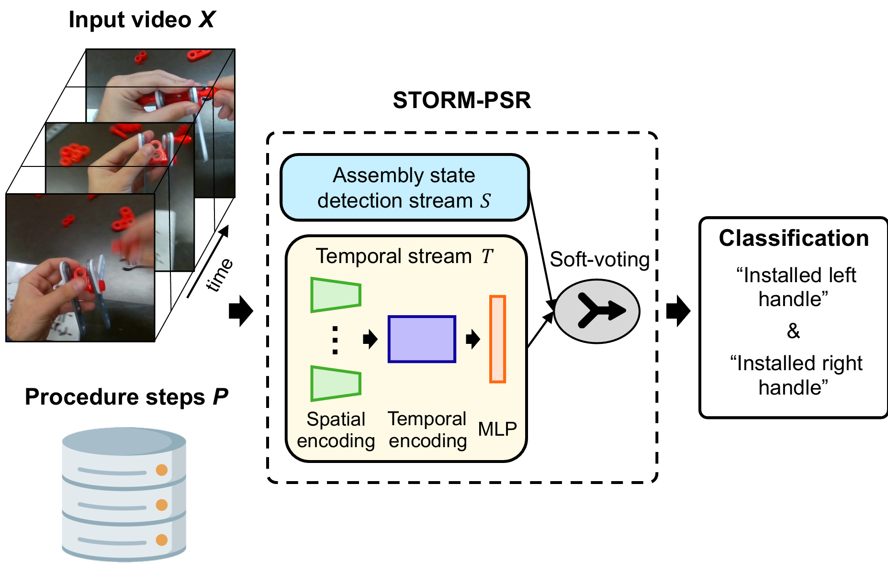

# Learning to Recognize Correctly Completed Procedure Steps in Egocentric Assembly Videos through Spatio-Temporal Modeling
> Check out our [project page](https://timschoonbeek.github.io/stormpsr.html) for more information!


We propose Spatio-Temporal Occlusion-Resilient Modeling for Procedure Step Recognition (STORM-PSR), a dual-stream framework for Procedure step recognition (PSR) that leverages both spatial and temporal features. PSR task aims to identify all correctly completed steps and their sequential order in videos of procedural tasks. The existing state-of-the-art models rely solely on detecting assembly object states in individual video frames.

STORM-PSR is evaluated on the MECCANO and IndustReal datasets, reducing the average delay between actual and predicted assembly step completions by 11.2\% and 26.1\%, respectively, compared to the [SOTA methods](https://openaccess.thecvf.com/content/WACV2024/papers/Schoonbeek_IndustReal_A_Dataset_for_Procedure_Step_Recognition_Handling_Execution_Errors_WACV_2024_paper.pdf).


## Getting Started
1. Clone the repository
```terminal
git clone [Redacted]
cd STORM-PSR
```
2. Setup and activate your conda environment, and install dependencies
```terminal
conda create --name storm-psr python=3.12.2
conda activate storm-psr
pip install -r STORM-PSR/requirements.txt
```
3. Dataset preparation
   * IndustReal:  Please refer to  [IndustReal github page](https://github.com/TimSchoonbeek/IndustReal) to download the datasets.
   * MECCANO: Please refer to [MECCANO github page](https://github.com/fpv-iplab/MECCANO) to download the datasets.
   * MECCANO-PSR annotation: Please refer to [here](https://github.com/TimSchoonbeek/PSR-annotations) to download the annotations.


## Object detection stream model
Please refer to the IndustReal assembly state detection [tutorial](https://github.com/TimSchoonbeek/IndustReal/tree/main/ASD) to train the assembly state detection stream.

## Temporal Stream model
### To train a temporal-stream model
```bash
cd STORM-PSR/temporal_stream/jobscript
sh train_test_eval_ft_pipeline.sh
```
### To test a temporal-stream model
```bash
cd STORM-PSR/temporal_stream/jobscript
sh test.sh
```

## To extract spatial embeddings
```bash
cd STORM-PSR/temporal_stream/pretrained_models
sh extract_embeddings.sh
```

## To evaluate a model
```bash
cd STORM-PSR/PSR_evaluation
# To evaluate the STORM-PSR model
sh evaluate_STORM_PSR.sh

 # To evaluate the assembly state detection stream
sh evaluate_ASDStream.sh

# To evaluate the Temporal Stream model
sh evaluate_TemporalStream.sh  
```


### To visualize spatial embedding using UMAP / t-SNE
Please refer to [STORM-PSR/temporal_stream/visualize_embedding/visualize_embedding.ipynb](./temporal_stream/visualize_embedding/visualize_embedding.ipynb) to visualize the spatial embedding using UMAP / t-SNE.

## Citation & Acknowledgements

If you use these annotations or tools, please cite the corresponding article:

```bibtex
@misc{schoonbeek2025learning,
  title={Learning to Recognize Correctly Completed Procedure Steps in Egocentric Assembly Videos through Spatio-Temporal Modeling},
  author={Tim J. Schoonbeek and Shao-Hsuan Hung and Dan Lehman and Hans Onvlee and Jacek Kustra and Peter H. N. de With and Fons van der Sommen},
  year={2025},
  eprint={2510.12385},
  archivePrefix={arXiv},
  primaryClass={cs.CV},
  url={https://arxiv.org/abs/2510.12385},
}